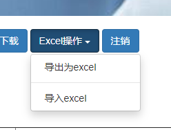

# EasyExcel和POI使用详解

## 一、Poi-Excel 写

### 1.常规入门

POI是Apache软件基金会的，POI为“Poor Obfuscation Implementation”的首字母缩写，意为“简洁版的模糊实现”。
所以**POI的主要功能是可以用Java操作Microsoft Office的相关文件**，这里我们主要讲Excel

> 1.导入依赖

```xml
<dependencies>
    <!--xls(03)-->
    <dependency>
        <groupId>org.apache.poi</groupId>
        <artifactId>poi</artifactId>
        <version>3.9</version>
    </dependency>
    <!--xls(07)-->
    <dependency>
        <groupId>org.apache.poi</groupId>
        <artifactId>poi-ooxml</artifactId>
        <version>3.9</version>
    </dependency>
    <!--日期格式化-->
    <dependency>
        <groupId>joda-time</groupId>
        <artifactId>joda-time</artifactId>
        <version>2.10.1</version>
    </dependency>
    <!--test-->
    <dependency>
        <groupId>junit</groupId>
        <artifactId>junit</artifactId>
        <version>4.13.2</version>
    </dependency>
</dependencies>
```

> 2 .开启读写操作，代码走起

无非就是对api的充分认识，接下来我们先去了解他的api

```java
 Workbook wordkbook =new HSSFWorkbook();//创建一个Workbook对象 工作簿
 wordkbook.createSheet();//创建表名，如果不写参数，会有默认值 工作表
 Row row1=sheet.createRow(0);//根据里面的数字拿到对应的行，0默认为第一行 行
 Cell cell = row1.createCell(0);//根据行对象创建单元格，这里0为第一个 列
 cell.setCellValue("");//可以给单元格赋值
```


> 3.写入

<font color="blue">**03版本**</font>

```java
public class PoiCreate {
    public String PATH = "E:\\untitled\\Excel操作\\";

    @Test
    //03版本 写入
    public void testWrite03() throws Exception {
        //1.创建一个工作簿
        Workbook workbook = new HSSFWorkbook();
        //2.创建一个工作表
        Sheet sheet = workbook.createSheet("Hollow在学Poi-2021-7-20");
        //3.创建一个行 (1,1)
        Row row1 = sheet.createRow(0);
        //4.创建一个单元格
        Cell cell11 = row1.createCell(0);
        cell11.setCellValue("座右铭:");
        //(1,2) 第一行第二列
        Cell cell12 = row1.createCell(1);
        cell12.setCellValue("努力不会说谎！");

        //(2,1) 第二行
        Row row2 = sheet.createRow(1);
        //(2,1)
        Cell cell21 = row2.createCell(0);
        cell21.setCellValue("当前时间:");
        //(2,2)
        Cell cell22 = row2.createCell(1);
        String time = new DateTime().toString("yyyy-MM-dd HH:mm:ss");
        cell22.setCellValue(time);

        //生成一张io流 03版本使用xls结尾
        FileOutputStream fileOutputStream = new FileOutputStream(PATH + "Hollow学习表03版.xls");
        //输出
        workbook.write(fileOutputStream);
        //关闭流
        fileOutputStream.close();

        //提示信息
        System.out.println("已经完成创建 Hollow学习表03版");
    }
}
```

==注：new HSSFWorkbook();  结尾是xls==

<font color="blue">**07版本**</font>

```java
public class PoiCreate {
    public String PATH = "E:\\untitled\\Excel操作\\";
    @Test
    //07版本 写入
    public void testWrite07() throws Exception {
        //1.创建一个工作簿
        Workbook workbook = new XSSFWorkbook();
        //2.创建一个工作表
        Sheet sheet = workbook.createSheet("Hollow在学Poi-2021-7-20");
        //3.创建一个行 (1,1)
        Row row1 = sheet.createRow(0);
        //4.创建一个单元格
        Cell cell11 = row1.createCell(0);
        cell11.setCellValue("座右铭:");
        //(1,2) 第一行第二列
        Cell cell12 = row1.createCell(1);
        cell12.setCellValue("努力不会说谎！");

        //(2,1) 第二行
        Row row2 = sheet.createRow(1);
        //(2,1)
        Cell cell21 = row2.createCell(0);
        cell21.setCellValue("当前时间:");
        //(2,2)
        Cell cell22 = row2.createCell(1);
        String time = new DateTime().toString("yyyy-MM-dd HH:mm:ss");
        cell22.setCellValue(time);

        //生成一张io流 03版本使用xls结尾
        FileOutputStream fileOutputStream = new FileOutputStream(PATH + "Hollow学习表07版.xlsx");
        //输出
        workbook.write(fileOutputStream);
        //关闭流
        fileOutputStream.close();

        //提示信息
        System.out.println("已经完成创建 Hollow学习表07版");
    }
}
```

==注：new XSSFWorkbook();  结尾是xlsx==

这里值得注意的是，使用表格对象要注意三种创建方式

- POI-HSSF
- POI-XSSF
- SXSSF

1. **HSSF：Excel97-2003版本，扩展名为.xls。一个sheet最大行数65536，最大列数256。**
2. **XSSF：Excel2007版本开始，扩展名为.xlsx。一个sheet最大行数1048576，最大列数16384。**

3. **SXSSF：是在XSSF基础上，POI3.8版本开始提供的支持低内存占用的操作方式，扩展名为.xlsx。**

**Excel版本兼容性是向下兼容。**


### 2.大数据写法

#### HSSF(03版本)写法

> 代码

```java
    @Test
    //03 大数据写入
    public void testWrite03BigData() throws Exception {
        long begin = System.currentTimeMillis();
        //1.创建一个工作簿
        Workbook workbook = new HSSFWorkbook();
        //2.创建一个工作表
        Sheet sheet = workbook.createSheet("BigData");
        //写入数据
        for (int rowNum = 0; rowNum < 65536; rowNum++) {
            Row row = sheet.createRow(rowNum);
            for (int cellNum = 0; cellNum < 10; cellNum++) {
                Cell cell = row.createCell(cellNum);
                cell.setCellValue(cellNum);
            }
        }

        //生成一张io流 03版本使用xls结尾
        FileOutputStream fileOutputStream = new FileOutputStream(PATH + "Hollow学习表03BigData版.xls");
        //输出
        workbook.write(fileOutputStream);
        //关闭流
        fileOutputStream.close();

        //提示信息
        System.out.println("已经完成创建 Hollow学习表03BigData版");
        long end = System.currentTimeMillis();
        System.out.println("共计用时："+(double)(end-begin)/1000+"s");
    }
```

> 结果图


> 优劣分析

缺点：不能超过65536行，否则会出现如下错误

`java.lang.IllegalArgumentException: Invalid row number (65536) outside allowable range (0..65535)`

优点：过程中写入缓存，不操作磁盘，最后一次性写入磁盘，速度快


#### XSSF(07版)本写法

>代码

```java
@Test
//07 大数据写入
public void testWrite07BigData() throws Exception {
    long begin = System.currentTimeMillis();
    //1.创建一个工作簿
    Workbook workbook = new XSSFWorkbook();
    //2.创建一个工作表
    Sheet sheet = workbook.createSheet("testWrite07BigData");
    //写入数据
    for (int rowNum = 0; rowNum < 65536; rowNum++) {
        Row row = sheet.createRow(rowNum);
        for (int cellNum = 0; cellNum < 10; cellNum++) {
            Cell cell = row.createCell(cellNum);
            cell.setCellValue(cellNum);
        }
    }

    //生成一张io流 03版本使用xls结尾
    FileOutputStream fileOutputStream = new FileOutputStream(PATH + "Hollow学习表07BigData版.xlsx");
    //输出
    workbook.write(fileOutputStream);
    //关闭流
    fileOutputStream.close();

    //提示信息
    System.out.println("已经完成创建 Hollow学习表07BigData版");
    long end = System.currentTimeMillis();
    System.out.println("共计用时："+(double)(end-begin)/1000+"s");
}
```

> 结果图


> 优劣分析

缺点:写数据时**速度非常慢**,非常耗内存,也会发生内存溢出,如100万条

优点:可以**写较大的数据量**,如20万条


#### SXSSF版本写法

> 代码

```java
@Test
//07 大数据写入 Super
public void testWrite07BigDataSuper() throws Exception {
    long begin = System.currentTimeMillis();
    //1.创建一个工作簿
    Workbook workbook = new SXSSFWorkbook();
    //2.创建一个工作表
    Sheet sheet = workbook.createSheet("testWrite07BigDataSuper");
    //写入数据
    for (int rowNum = 0; rowNum < 100000; rowNum++) {
        Row row = sheet.createRow(rowNum);
        for (int cellNum = 0; cellNum < 10; cellNum++) {
            Cell cell = row.createCell(cellNum);
            cell.setCellValue(cellNum);
        }
    }

    //生成一张io流 03版本使用xls结尾
    FileOutputStream fileOutputStream = new FileOutputStream(PATH + "Hollow学习表07BigData版Super.xlsx");
    //输出
    workbook.write(fileOutputStream);
    //关闭流
    fileOutputStream.close();
    //清除临时文件
    ((SXSSFWorkbook) workbook).dispose();
    //提示信息
    System.out.println("已经完成创建 Hollow学习表07BigData版Super");
    long end = System.currentTimeMillis();
    System.out.println("共计用时："+(double)(end-begin)/1000+"s");
}
```

> 结果图


==1W条数据很快，但是需要清除临时文件==

```java
//清除临时文件
((SXSSFWorkbook) workbook).dispose();
```
> 优劣分析

优点:可以写非常大的数据量，如100万条甚至更多条,写数据速度快,占用更少的内存

**注意:**

过程中会产生临时文件,**需要清理临时文件**

默认由100条记录被保存在内存中,如果超过这数量,则最前面的数据被写入临时文件 如果想自定义内存中数据的数量,可以使用new SXSSFWorkbook(数量)

SXSSFWorkbook-来至官方的解释:实现"BigGridDemo"策略的流式XSSFWorkbook版本。这允许写入非常大的文件而不会耗尽内存,因为任何时候只有可配置的行部分被保存在内存中。

请注意,仍然可能会消耗大量内存,这些内存基于您正在使用的功能,例如合并区域,注....仍然只存储在内存中,因此如果广泛使用,可能需要大量内存。

## 二、Poi-Excel 读

### 1.常规入门

**03版本读取**

> 代码

```java
public class PoiRead {
    public String PATH = "E:\\untitled\\Excel操作\\";

    @Test
    //03版本 读取
    public void testRead03() throws Exception {
        //获取文件流
        FileInputStream inputStream = new FileInputStream(PATH + "Hollow学习表03版.xls");

        //1.创建一个工作簿
        Workbook workbook = new HSSFWorkbook(inputStream);
        //2.创建一个工作表
        Sheet sheet = workbook.getSheetAt(0);
        //3.得到行
        Row row1 = sheet.getRow(0);
        Row row2 = sheet.getRow(1);
        //4.得到列
        Cell cell11 = row1.getCell(0);
        Cell cell12 = row1.getCell(1);
        Cell cell22 = row2.getCell(1);

        System.out.println(cell11.getStringCellValue());
        System.out.println(cell12.getNumericCellValue());
        System.out.println(cell22.getStringCellValue());
        inputStream.close();
    }
}
```

> 结果图


==注意类型的转换，得到正确的类型值==

------

**07版本读取**

> 代码

```java
@Test
//07版本 读取
public void testRead07() throws Exception {
    //获取文件流
    FileInputStream inputStream = new FileInputStream(PATH + "Hollow学习表07版.xlsx");

    //1.创建一个工作簿
    Workbook workbook = new XSSFWorkbook(inputStream);
    //2.创建一个工作表
    Sheet sheet = workbook.getSheetAt(0);
    //3.得到行
    Row row1 = sheet.getRow(0);
    Row row2 = sheet.getRow(1);
    //4.得到列
    Cell cell11 = row1.getCell(0);
    Cell cell12 = row1.getCell(1);
    Cell cell22 = row2.getCell(1);

    System.out.println(cell11.getStringCellValue());
    System.out.println(cell12.getNumericCellValue());
    System.out.println(cell22.getStringCellValue());
    inputStream.close();
}
```

> 结果图


==注意点：必须确认版本后缀名是否符合，否则就会出现如下类型报错==

`org.apache.poi.POIXMLException: org.apache.poi.openxml4j.exceptions.InvalidFormatException: Package should contain a content type part [M1.13]`

**SXSSF版本如上修改**


### 2.复杂类型输入

> 代码

```java
    @Test
    //03版本 读取
    public void testRead03CellType() throws Exception {
        //获取文件流
        FileInputStream inputStream = new FileInputStream(PATH + "入党表.xls");
        //1.创建一个工作簿
        Workbook workbook = new HSSFWorkbook(inputStream);
        //2.创建一个工作表
        Sheet sheet = workbook.getSheetAt(0);
        //获取标题内容
        Row rowTitle = sheet.getRow(1);
        if (rowTitle != null) {
            //一定要掌握 查看有多少列
            int cellCount = rowTitle.getPhysicalNumberOfCells();
            System.out.println("cellCount:" + cellCount);
            for (int cellNum = 0; cellNum < cellCount; cellNum++) {
                Cell cell = rowTitle.getCell(cellNum);
                if (cell != null) {
                    int cellType = cell.getCellType();
                    String cellValue = cell.getStringCellValue();
//                    System.out.print("cellType:"+cellType);
                    System.out.print(cellValue + "|");
                }
            }
            System.out.println();
        }
        System.out.println("---------------------------------------------------------------");

        //获取表中的内容
        //查看表中有多少行
        int rowCount = sheet.getPhysicalNumberOfRows();
//        System.out.println("rowCount:"+rowCount);
        for (int rowNum = 2; rowNum < rowCount; rowNum++) { //从2开始：从真正的数据开始
            Row rowData = sheet.getRow(rowNum);
            if (rowData != null) {
                //读取列 看有多少列
                int cellCount = rowData.getPhysicalNumberOfCells();
//                System.out.println("cellCount:"+cellCount);
                for (int cellNum = 0; cellNum < cellCount; cellNum++) {
                    System.out.print("[" + rowNum + "," + cellNum + "]  ");
                    Cell cell = rowData.getCell(cellNum);

                    //匹配列的数据类型
                    if (cell != null) {
                        int cellType = cell.getCellType();
                        String cellValue = "";

                        switch (cellType) {
                            case HSSFCell.CELL_TYPE_STRING: //字符串
                                System.out.print("String ");
                                cellValue = cell.getStringCellValue();
                                break;
                            case HSSFCell.CELL_TYPE_BOOLEAN: //布尔
                                System.out.print("Boolean ");
                                cellValue = String.valueOf(cell.getBooleanCellValue());
                                break;
                            case HSSFCell.CELL_TYPE_BLANK: //空
                                System.out.print("Blank ");
                                break;
                            case HSSFCell.CELL_TYPE_NUMERIC: //数字（日期，普通数字）
                                System.out.print("Numeric ");
                                if (HSSFDateUtil.isCellDateFormatted(cell)) { //日期
                                    System.out.print("日期 ");
                                    Date date = cell.getDateCellValue();
                                    cellValue = new DateTime(date).toString("yyyy-MM-dd");
                                } else {
                                    //不是日期格式，防止数字太长转换类型
                                    System.out.print("转换为字符串输出 ");
                                    cell.setCellType(HSSFCell.CELL_TYPE_STRING);
                                    cellValue = cell.toString();
                                }
                                break;
                            case HSSFCell.CELL_TYPE_ERROR: //错误
                                System.out.print("数据类型错误 ");
                                break;
                        }
                        System.out.println(cellValue);
                    }
                }
                System.out.println(); //每一行输出换行
            }
        }
        
        inputStream.close();
    }
}
```


> 结果图


> 工具类提取

```java
    @Test
    //提取为工具类
    public void testRead03CellType(FileInputStream inputStream) throws Exception {
        //1.创建一个工作簿
        Workbook workbook = new HSSFWorkbook(inputStream);
        //2.创建一个工作表
        Sheet sheet = workbook.getSheetAt(0);
        //获取标题内容
        Row rowTitle = sheet.getRow(1);
        if (rowTitle != null) {
            //一定要掌握 查看有多少列
            int cellCount = rowTitle.getPhysicalNumberOfCells();
            System.out.println("cellCount:" + cellCount);
            for (int cellNum = 0; cellNum < cellCount; cellNum++) {
                Cell cell = rowTitle.getCell(cellNum);
                if (cell != null) {
                    int cellType = cell.getCellType();
                    String cellValue = cell.getStringCellValue();
//                    System.out.print("cellType:"+cellType);
                    System.out.print(cellValue + "|");
                }
            }
            System.out.println();
        }
        System.out.println("---------------------------------------------------------------");

        //获取表中的内容
        //查看表中有多少行
        int rowCount = sheet.getPhysicalNumberOfRows();
//        System.out.println("rowCount:"+rowCount);
        for (int rowNum = 2; rowNum < rowCount; rowNum++) { //从2开始：从真正的数据开始
            Row rowData = sheet.getRow(rowNum);
            if (rowData != null) {
                //读取列 看有多少列
                int cellCount = rowData.getPhysicalNumberOfCells();
//                System.out.println("cellCount:"+cellCount);
                for (int cellNum = 0; cellNum < cellCount; cellNum++) {
                    System.out.print("[" + rowNum + "," + cellNum + "]  ");
                    Cell cell = rowData.getCell(cellNum);

                    //匹配列的数据类型
                    if (cell != null) {
                        int cellType = cell.getCellType();
                        String cellValue = "";

                        switch (cellType) {
                            case HSSFCell.CELL_TYPE_STRING: //字符串
                                System.out.print("String ");
                                cellValue = cell.getStringCellValue();
                                break;
                            case HSSFCell.CELL_TYPE_BOOLEAN: //布尔
                                System.out.print("Boolean ");
                                cellValue = String.valueOf(cell.getBooleanCellValue());
                                break;
                            case HSSFCell.CELL_TYPE_BLANK: //空
                                System.out.print("Blank ");
                                break;
                            case HSSFCell.CELL_TYPE_NUMERIC: //数字（日期，普通数字）
                                System.out.print("Numeric ");
                                if (HSSFDateUtil.isCellDateFormatted(cell)) { //日期
                                    System.out.print("日期 ");
                                    Date date = cell.getDateCellValue();
                                    cellValue = new DateTime(date).toString("yyyy-MM-dd");
                                } else {
                                    //不是日期格式，防止数字太长转换类型
                                    System.out.print("转换为字符串输出 ");
                                    cell.setCellType(HSSFCell.CELL_TYPE_STRING);
                                    cellValue = cell.toString();
                                }
                                break;
                            case HSSFCell.CELL_TYPE_ERROR: //错误
                                System.out.print("数据类型错误 ");
                                break;
                        }
                        System.out.println(cellValue);
                    }
                }
                System.out.println(); //每一行输出换行
            }
        }

        inputStream.close();
    }
```

==注意数据类型转换即可==

### 3.读取复杂公式

> 代码

```java
@Test
//03版本 读取公式
public void testReadFormula() throws Exception {
    //获取文件流
    FileInputStream inputStream = new FileInputStream(PATH + "公式.xls");
    //1.创建一个工作簿
    Workbook workbook = new HSSFWorkbook(inputStream);
    //2.创建一个工作表
    Sheet sheet = workbook.getSheetAt(0);

    Row row = sheet.getRow(3);
    Cell cell = row.getCell(0);

    //拿到计算公式 eval
    FormulaEvaluator FormulaEvaluator = new HSSFFormulaEvaluator((HSSFWorkbook) workbook);

    //输出单元格的内容
    int cellType = cell.getCellType();
    switch (cellType){
        case Cell.CELL_TYPE_FORMULA:
            String formula = cell.getCellFormula();
            System.out.println(formula);

            //计算
            CellValue evaluate = FormulaEvaluator.evaluate(cell);
            String cellValue = evaluate.formatAsString();
            System.out.println(cellValue);
            break;
    }
    
    inputStream.close();
}
```

> 结果图


## 三、EasyExcel

参考文档：https://alibaba-easyexcel.github.io/quickstart/read.html

### 1.常规入门

> 导入依赖

```xml
        <dependency>
            <groupId>com.alibaba</groupId>
            <artifactId>easyexcel</artifactId>
            <version>2.2.10</version>
        </dependency>
        <dependency>
            <groupId>com.alibaba</groupId>
            <artifactId>fastjson</artifactId>
            <version>1.2.75</version>
        </dependency>
```


### 2.EasyExcel写操作

> 代码

DemoData

```java
@Data
public class DemoData {
    @ExcelProperty("字符串标题")
    private String string;
    @ExcelProperty("日期标题")
    private Date date;
    @ExcelProperty("数字标题")
    private Double doubleData;
    /**
     * 忽略这个字段
     */
    @ExcelIgnore
    private String ignore;
}
```

FirstTest

```java
public class FirstTest {
    public final String PATH = "E:\\untitled\\POIandEasy\\";

    private List<DemoData> data() {
        List<DemoData> list = new ArrayList<DemoData>();
        for (int i = 0; i < 10; i++) {
            DemoData data = new DemoData();
            data.setString("字符串" + i);
            data.setDate(new Date());
            data.setDoubleData(0.56);
            list.add(data);
        }
        return list;
    }

    //写方法
    @Test
    public void simpleWrite() {
        // 写法1
        String fileName = PATH + "easyExcel.xlsx";
        // 这里 需要指定写用哪个class去写，然后写到第一个sheet，名字为模板 然后文件流会自动关闭
        // 如果这里想使用03 则 传入excelType参数即可
        /**
         * write(文件名，格式类)
         * sheet(表名)
         * doWrite(写数据进去)
         */
        EasyExcel.write(fileName, DemoData.class).sheet("模板").doWrite(data());
    }
}
```

> 结果图


### 3.EasyExcel读操作

> 代码

DemoDataListener

```java
// 有个很重要的点 DemoDataListener 不能被spring管理，要每次读取excel都要new,然后里面用到spring可以构造方法传进去
public class DemoDataListener extends AnalysisEventListener<DemoData> {
    private static final Logger LOGGER = LoggerFactory.getLogger(DemoDataListener.class);
    /**
     * 每隔5条存储数据库，实际使用中可以3000条，然后清理list ，方便内存回收
     */
    private static final int BATCH_COUNT = 5;
    List<DemoData> list = new ArrayList<DemoData>();
    /**
     * 假设这个是一个DAO，当然有业务逻辑这个也可以是一个service。当然如果不用存储这个对象没用。
     */
    private DemoDAO demoDAO;

    public DemoDataListener() {
        // 这里是demo，所以随便new一个。实际使用如果到了spring,请使用下面的有参构造函数
        demoDAO = new DemoDAO();
    }

    /**
     * 如果使用了spring,请使用这个构造方法。每次创建Listener的时候需要把spring管理的类传进来
     *
     * @param demoDAO
     */
    public DemoDataListener(DemoDAO demoDAO) {
        this.demoDAO = demoDAO;
    }

    /**
     * 这个每一条数据解析都会来调用
     */
    @Override
    public void invoke(DemoData data, AnalysisContext context) {
        System.out.println(JSON.toJSONString(data));
        LOGGER.info("解析到一条数据:{}", JSON.toJSONString(data));
        list.add(data);
        // 达到BATCH_COUNT了，需要去存储一次数据库，防止数据几万条数据在内存，容易OOM
        if (list.size() >= BATCH_COUNT) {
            saveData();
            // 存储完成清理 list
            list.clear();
        }
    }

    /**
     * 所有数据解析完成了 都会来调用
     *
     * @param context
     */
    @Override
    public void doAfterAllAnalysed(AnalysisContext context) {
        // 这里也要保存数据，确保最后遗留的数据也存储到数据库
        saveData();
        LOGGER.info("所有数据解析完成！");
    }

    /**
     * 加上存储数据库
     */
    private void saveData() {
        LOGGER.info("{}条数据，开始存储数据库！", list.size());
        demoDAO.save(list);
        LOGGER.info("存储数据库成功！");
    }
}
```

DemoDAO

```java
/**
 * 假设这个是你的DAO存储。当然还要这个类让spring管理，当然你不用需要存储，也不需要这个类。
 **/
public class DemoDAO {
    public void save(List<DemoData> list) {
        // 如果是mybatis,尽量别直接调用多次insert,自己写一个mapper里面新增一个方法batchInsert,所有数据一次性插入
    }
}
```

FirstTest

```java
    //读方法
    /**
     * 最简单的读
     * <p>1. 创建excel对应的实体对象 参照{@link DemoData}
     * <p>2. 由于默认一行行的读取excel，所以需要创建excel一行一行的回调监听器，参照{@link DemoDataListener}
     * <p>3. 直接读即可
     */
    @Test
    public void simpleRead() {
        // 有个很重要的点 DemoDataListener 不能被spring管理，要每次读取excel都要new,然后里面用到spring可以构造方法传进去
        // 写法1：
        String fileName = PATH + "easyExcel.xlsx";
        // 这里 需要指定读用哪个class去读，然后读取第一个sheet 文件流会自动关闭
        EasyExcel.read(fileName, DemoData.class, new DemoDataListener()).sheet().doRead();
    }
```

> 结果图


### 4.总结

easyExcel主要还是看文档去学习。


参考博客：https://blog.csdn.net/jiohfgj/article/details/105724073

参考视频：https://www.bilibili.com/video/BV1Ua4y1x7BK?p=2&spm_id_from=pageDriver

### ==5.项目参考实例==

#### 1) 前端代码

```html
<div class="btn-group">
    <button type="button" class="btn btn-primary dropdown-toggle" data-toggle="dropdown">Excel操作
        <span class="caret"></span>
    </button>
    <ul class="dropdown-menu" role="menu">
        <li>
            <a href="${pageContext.request.contextPath}/excel/writeExcel">导出为excel</a>
        </li>
        <li class="divider"></li>
        <li>
            <a data-toggle="modal" data-target="#myExcelModal">导入excel</a>
        </li>
    </ul>
</div>


<!-- 上传excel功能 模态框（Modal） -->
<div class="modal fade" id="myExcelModal" tabindex="-1" role="dialog" aria-labelledby="myExcelModalLabel" aria-hidden="true">
    <div class="modal-dialog">
        <div class="modal-content">
            <div class="modal-header">
                <button type="button" class="close" data-dismiss="modal" aria-hidden="true">&times;</button>
                <h4 class="modal-title" id="myExcelModalLabel" align="center">Excel文件上传</h4>
            </div>
            <div class="modal-body">
                <form class="form-horizontal" id="excel_form" role="form"
                      action="${pageContext.request.contextPath}/excel/readExcel"
                      method="post"
                      enctype="multipart/form-data">
                        <label for="file" class="col-md-5 control-label">选择上传文件：（只接收xls,xlsx文件）</label>
                        <div class="input-group col-md-7">
                            <input class="btn" type="file" name="excelfile" id="file" width="120px"
                                   accept="application/vnd.ms-excel,application/vnd.openxmlformats-officedocument.spreadsheetml.sheet">
                        </div>
                </form>
            </div>
            <div class="modal-footer" align="center">
                <button type="button" id="excel_btn" class="btn btn-primary" data-dismiss="modal">上传</button>
                <button type="button" class="btn btn-default" data-dismiss="modal">关闭</button>
            </div>
        </div><!-- /.modal-content -->
    </div><!-- /.modal -->
</div>
```

```js
//点击模态框下面按钮可提交表单
$(document).ready(function () {
    $("#excel_btn").click(function () {
        $("#excel_form").submit();
    });
});
```

**注：主要用了boostrap的模态框，==name值一定要确定好==，否则后端无法接收会报空指针错误**

#### 2) 后端代码

ExcelController

```java
package com.controller;
@Controller
@RequestMapping("/excel")
public class ExcelController {
    public final String PATH = "C:\\Users\\Administrator\\Desktop\\Big HomeWork\\Final\\spring-mvc-big-home\\";

    @Autowired
    private DemoServiceImpl demoService;

    //存数据入data，用于excel表格导出
    private List<Equipment> data() {
        List<Equipment> equipmentList = demoService.queryAllEquipment();
        for (Equipment equipment : equipmentList) {
            System.out.println(equipment);
        }
        return equipmentList;
    }

    //写数据，写数据导出excel
    @RequestMapping("writeExcel")
    public String simpleWrite(HttpSession httpSession) {
        // 写法1
        String fileName = PATH + "实验室设备信息表.xlsx";
        // 这里 需要指定写用哪个class去写，然后写到第一个sheet，名字为模板 然后文件流会自动关闭
        // 如果这里想使用03 则 传入excelType参数即可
        /**
         * write(文件名，格式类)
         * sheet(表名)
         * doWrite(写数据进去)
         */
        EasyExcel.write(fileName, Equipment.class).sheet("设备信息").doWrite(data());

        httpSession.setAttribute("excelMsg","成功导出！");
        return "redirect:/findAllEquipment.do";
    }


    @RequestMapping("readExcel")
    public String simpleRead(@RequestParam("excelfile") MultipartFile file, HttpSession httpSession) throws IOException {
        // 有个很重要的点 DemoDataListener 不能被spring管理，要每次读取excel都要new,然后里面用到spring可以构造方法传进去
//        String fileName = PATH + "实验室设备信息表上传表单.xlsx";
        // 这里 需要指定读用哪个class去读，然后读取第一个sheet 文件流会自动关闭
        /*file.getInputStream()可以代替路径fileName*/
        EasyExcel.read(file.getInputStream(), Equipment.class, new DemoDataListener(demoService)).sheet().doRead();

        httpSession.setAttribute("excelMsg","成功导入！");
        return "redirect:/findAllEquipment.do";
    }

}
```

Dao层以及其他参考：https://segmentfault.com/a/1190000040223765?utm_source=tag-newest

#### 3) 运行结果




#### 4) 细节知识点

**重定向与转发**概念：重定向改变地址，转发不改变原来地址

参考：https://blog.csdn.net/weixin_40001125/article/details/88663468


**前端代码中Accept**概念：

`accept="application/vnd.ms-excel,application/vnd.openxmlformats-officedocument.spreadsheetml.sheet">`

可以限制传递的文件类型

参考：https://blog.csdn.net/hanshileiai/article/details/44702923